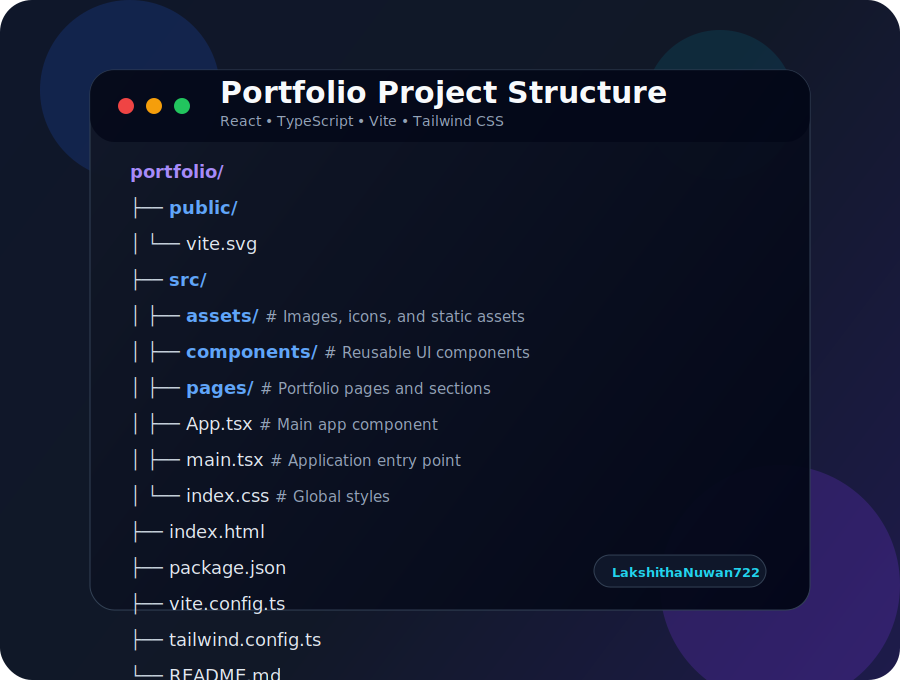

# Lakshitha Nuwan's Portfolio

A modern, responsive, and highly interactive personal portfolio website showcasing my projects, skills, and experience in **Full-Stack Development**, **Mobile App Development**, and **AI/ML Engineering**.

Built with **React**, **TypeScript**, **Vite**, and styled using **Tailwind CSS**.

---

## 🚀 Live Demo

View the live portfolio here:

🔗 [Lakshitha Nuwan Portfolio](https://LakshithaNuwan722.github.io/portfolio)

---

## 🛠️ Tech Stack

- **Frontend Framework:** React 19
- **Language:** TypeScript
- **Build Tool:** Vite
- **Styling:** Tailwind CSS v4
- **Animations:** Framer Motion
- **Icons:** Lucide React
- **Routing:** React Router DOM
- **Deployment:** GitHub Pages

---

## ✨ Features

- 🎨 **Modern UI/UX**  
  Clean, sleek, and interactive design with smooth transitions and animations.

- 🌗 **Dark/Light Mode**  
  Supports both dark and light themes for a better user experience.

- 📱 **Fully Responsive Design**  
  Optimized for desktop, tablet, and mobile devices.

- 🚀 **Project Showcase**  
  Displays projects across multiple domains, including:

  **AI / ML Projects**
  - QueryMind
  - VisionAI Studio
  - Sri Lankan Legal AI Assistant

  **Full-Stack Projects**
  - Touraa
  - e-Passport Issuing System
  - LuxeSalon

  **Mobile App Projects**
  - FitSmart
  - CeylonTrail

- ⚡ **Fast Performance**  
  Powered by Vite for quick development and optimized production builds.

---

## 📁 Project Structure



---

## 🚀 Deployment

This project is deployed using **GitHub Pages**.

Live URL:

```txt
https://LakshithaNuwan722.github.io/portfolio
```

If deploying with Vite to GitHub Pages, make sure your `vite.config.ts` includes:

```ts
import { defineConfig } from "vite";
import react from "@vitejs/plugin-react";

export default defineConfig({
  plugins: [react()],
  base: "/portfolio/",
});
```

---

## 🤝 Contact

**Lakshitha Nuwan**

- GitHub: [LakshithaNuwan722](https://github.com/LakshithaNuwan722)
- Portfolio: [Live Website](https://LakshithaNuwan722.github.io/portfolio)

---

## 🔗 Project Link

GitHub Repository:

[https://github.com/LakshithaNuwan722/portfolio](https://github.com/LakshithaNuwan722/portfolio)

---

## ⭐ Support

If you like this project, feel free to give it a star on GitHub!
